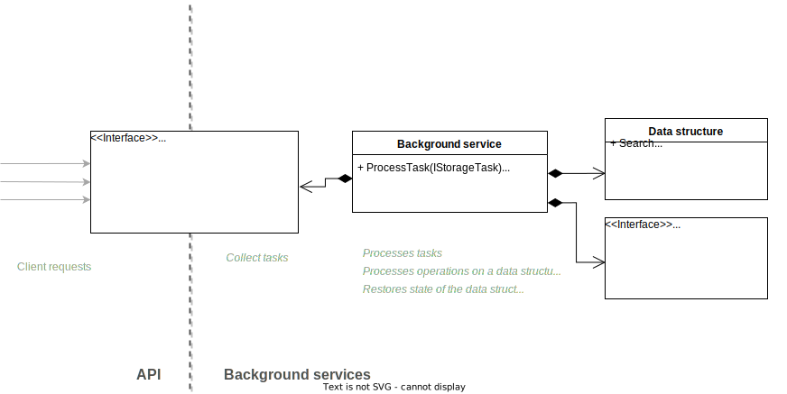

# Storage service


In-memory key-value storage via binary splay tree implementation (and apache cassandra for service state storing)



### Stack technology
* ASP.Net Core
* Cassandra (with Datastax driver)
* Xunit

### Features
* Data structure based on splay binary tree (bottom-up implementation)
* Operation sourcing on data structure (event sourcing)
* Tasks queue for operations on data structure

## Docker
You can try it using docker:
```bash
docker compose up -d
```
Then you can visit Swagger UI (http://localhost:8000/swagger) and interact with the service.
